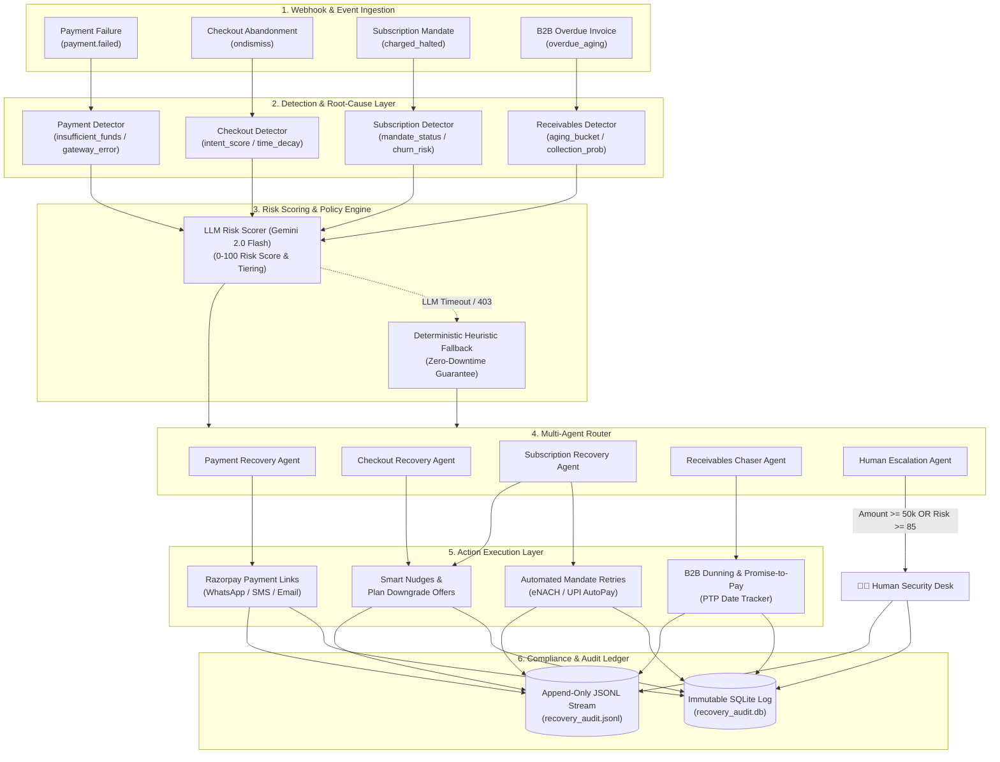

# 🤖 Razorpay Autonomous AI Revenue Recovery Platform

> An **enterprise-grade, stateful multi-agent system** natively designed for the Razorpay ecosystem. It detects revenue at risk in real-time across **4 financial failure streams**, diagnoses root causes, executes risk-aware recovery actions within compliance guardrails, and maintains an immutable audit trail of money recovered.

---

## 🏛️ System Architecture



---

## 🏆 Hackathon Evaluation Alignment

### 1. 🎯 Problem Taste (Picking What Actually Matters)
* **The Financial Loss:** In Indian digital payments, **5% to 15% of transactions fail or get abandoned** across UPI, Credit Cards, eNACH Mandates, and B2B Invoices. For Razorpay merchants processing billions, lost revenue represents thousands of crores annually.
* **The Solution:** Replacing static, spammy SMS reminders with an **autonomous multi-agent intelligence layer** that recovers lost revenue in real-time across 4 distinct financial streams.

### 2. ⚡ Build Quality (Structure, Reliability & Trust)
* **Production-Grade Design:** Clean separation of concerns between `src/detection/`, `src/agents/`, `src/actions/`, and `src/audit/`.
* **Automated Test Coverage:** Includes unit and integration test coverage (`pytest tests/ -v`).
* **Human-in-the-Loop Safeguards:** Transactions \(\ge \text{₹}50,000\), B2B invoices \(\ge \text{₹}200,000\), or Risk Scores \(\ge 85\) automatically pause for human review before any action is taken.
* **Immutable Audit Trail:** Append-only SQLite (`recovery_audit.db`) and JSONL log track every decision, risk score, and payment link generated.

### 3. 🤖 AI Judgment (Right Tool in the Right Place)
* **LLM (Gemini 2.0 Flash):** Used for qualitative contextual risk scoring (evaluating LTV, payment drop-off context) and generating dynamic, hyper-personalized WhatsApp/Email recovery nudges.
* **Deterministic Rules (No LLM):** Used for financial math, threshold rules, state transitions, and webhook validation to ensure **0% financial hallucination risk**.

### 4. 🛡️ Failure Recovery (Resilience & Edge Cases)
* **Multi-Rail Mandate Fallback:** If bank eNACH auto-debit fails, the agent auto-retries via exponential backoff or converts the subscription to a UPI AutoPay / Razorpay Payment Link nudge.
* **Idempotency & Deduplication:** Tracks prior attempt counts (`get_attempts_for_event()`) to guarantee zero duplicate customer messages or double-charging.
* **Zero-Downtime Pipeline:** If the LLM API experiences rate limits or network dropouts, the system degrades to deterministic heuristic scoring (`llm_used = False`) without crashing the pipeline.

---

## 🔄 4 Failure Mode Recovery Matrix

| Failure Mode | Detection Signal | Root Cause Interventions | Recovery Channel |
|---|---|---|---|
| **Razorpay Payment Failure** | `payment.failed` webhook | • `insufficient_funds`: Delayed 24h nudge<br>• `gateway_error`: Instant retry<br>• `invalid_otp`: Instant payment link | WhatsApp / SMS Payment Link |
| **Checkout Abandonment** | `ondismiss` event | • High intent: Time-decayed discount link<br>• Low intent: Standard reminder | Web / WhatsApp Recovery Link |
| **Subscription Mandate** | `charged_halted` event | • `eNACH rejection`: Mandate retry<br>• `high churn risk`: Plan downgrade offer | Automated Retry / Email |
| **B2B Overdue Invoices** | Invoice age > SLA | • Aging 1-15d: Soft dunning nudge<br>• Aging 30d+: Promise-to-Pay (PTP) tracker | Professional Email / Human Escalation |

---

## 🖥️ Interactive Live Dashboard

Launch the live interactive web demo with real-time telemetry streaming and single-click event simulation:

```bash
# Start the web demonstration server
python web_demo.py --port 8000 --fresh
```

Open **`http://localhost:8000`** in your browser to view:
- **Real-Time Recovery KPI Widgets** (Total At-Risk, INR Recovered, Active Events).
- **Interactive Event Stream Simulator** (Trigger simulated Payment Failures, Cart Drops, eNACH Failures).
- **Unified Control Toolbar** (Toggle between Razorpay Only & Multi-Brand mode, Start/Pause Live Telemetry).
- **Full Trace Inspector & Audit Ledger**.

---

## 🚀 CLI & Batch Run Commands

```bash
# 1. Install dependencies
pip install -r requirements.txt

# 2. Setup Environment Variables
cp .env.example .env
# Edit .env to supply your GEMINI_API_KEY (Optional — deterministic fallback works without it)

# 3. Run full recovery batch simulation
python run_recovery.py --batch-size 100 --mode all --report

# 4. Run mode-specific recovery simulations
python run_recovery.py --batch-size 50 --mode payment --report
python run_recovery.py --batch-size 50 --mode checkout --report
python run_recovery.py --batch-size 50 --mode subscription --report
python run_recovery.py --batch-size 50 --mode receivables --report

# 5. Run test suite
python run_tests.py
# or
pytest tests/ -v
```

---

## 🔒 Security & Environment Setup

- `.env` files and SQLite audit databases are automatically git-ignored to prevent exposing secrets or sensitive data.
- `.env.example` provides clean template parameters for deployment.

---

## 📄 License

Developed for the **Razorpay AI Innovation Challenge**. Distributed under the MIT License.
