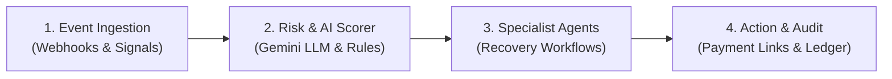
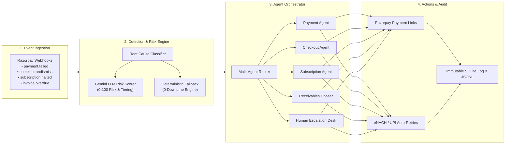

# Razor-RevX: Autonomous AI Revenue Recovery Platform

An enterprise-grade, stateful multi-agent system natively designed for the Razorpay ecosystem. It detects revenue at risk in real-time across 4 financial failure streams, diagnoses root causes, executes risk-aware recovery actions within compliance guardrails, and maintains an immutable audit trail of money recovered.

---

## Product Screenshots & Live Dashboard Walkthrough

### 1. Executive Recovery KPIs & Control Toolbar

*Real-time monitoring of revenue at risk, total recovered INR, recovery rate percentage, escalations, and active telemetry.*

### 2. Live Stream & Payment Brand Filtering Dropdown

*Unified selector toolbar for filtering telemetry events by Transactional Event Streams or Specific Payment Brands (Google Pay, CRED, PhonePe, Paytm, HDFC eNACH).*

### 3. Multi-Agent Execution Pipeline

*Step-by-step diagnostic breakdown showing root cause detection, LLM risk scoring (0-100), supervisor agent routing, and action execution.*

### 4. Razorpay Payment Recovery Portal Modal

*Customer-facing recovery checkout portal supporting instant payment completion across Google Pay, CRED Pay, PhonePe, and Razorpay.*

### 5. Immutable Compliance Audit Ledger

*Complete audit trail logging every decision, agent reasoning, risk score, and payment link generated into an append-only SQLite database.*

---

## System Architecture

### 1. High-Level Pipeline Overview

Razor-RevX operates as a simple, high-performance 4-stage pipeline:



1. **Event Ingestion:** Listens to payment failures, checkout drop-offs, mandate declines, and overdue invoices in real-time.
2. **Risk & AI Scorer:** Evaluates transaction risk score (0-100) using LLM reasoning and deterministic guardrails.
3. **Specialist Agents:** Routes cases to dedicated recovery agents (Payment, Checkout, Subscription, or B2B Receivables).
4. **Action & Audit:** Executes automated payment link nudges or mandate retries, and logs every action into an append-only audit ledger.

---

### 2. Deep-Dive Technical Architecture

Below is the detailed end-to-end component flow mapping webhook ingestion, root-cause classification, risk policy scoring, multi-agent orchestration, and audit logging:



---

## Tech Stack

| Layer | Technology | Purpose & Implementation |
|---|---|---|
| **AI & Intelligence** | **Gemini 2.0 Flash** (`google-genai`) | Contextual risk scoring (0-100), LTV evaluation & personalized WhatsApp/Email nudge composition. |
| **Fallback Engine** | **Deterministic Heuristic Engine** | 0-downtime rule-based policy engine for 100% SLA resilience during network or API limits. |
| **Core AI Service** | **Python 3.10+ & Pydantic v2** | High-performance multi-agent orchestration, event routing, and type-safe schema validation. |
| **Frontend UI** | **HTML5 & Vanilla JavaScript (ES6)** | Zero-framework, high-performance real-time interactive telemetry dashboard. |
| **Styling & Design** | **Tailwind CSS & Google Fonts** | Custom Razorpay Royal Blue design system with **Plus Jakarta Sans** & **Inter** typography. |
| **Audit Ledger** | **SQLite 3 & JSONL** | Append-only immutable compliance database (`recovery_audit.db` & `recovery_audit.jsonl`). |
| **Testing Suite** | **Pytest 8+** | Automated unit, integration, and edge-case test suite (`run_tests.py`). |

> **Production Integration Architecture:** While core banking gateways traditionally run on Java, **Razor-RevX is built in Python 3.10+** — the industry standard for LLM multi-agent systems. It integrates with enterprise payment gateways via standardized REST/gRPC webhooks (`payment.failed`, `checkout.ondismiss`), keeping card vaulting isolated while providing real-time AI recovery orchestration.

---

## Razor-RevX Evaluation Framework

### 1. Problem Taste (Picking What Actually Matters)
* **The Financial Loss:** In Indian digital payments, 5% to 15% of transactions fail or get abandoned across UPI, Credit Cards, eNACH Mandates, and B2B Invoices. For Razorpay merchants processing billions, lost revenue represents thousands of crores annually.
* **The Solution:** Replacing static, spammy SMS reminders with an autonomous multi-agent intelligence layer that recovers lost revenue in real-time across 4 distinct financial streams.

### 2. Build Quality (Structure, Reliability & Trust)
* **Production-Grade Design:** Clean separation of concerns between `src/detection/`, `src/agents/`, `src/actions/`, and `src/audit/`.
* **Automated Test Coverage:** Includes unit and integration test coverage (`pytest tests/ -v`).
* **Human-in-the-Loop Safeguards:** Transactions >= ₹50,000, B2B invoices >= ₹200,000, or Risk Scores >= 85 automatically pause for human review before any action is taken.
* **Immutable Audit Trail:** Append-only SQLite (`recovery_audit.db`) and JSONL log track every decision, risk score, and payment link generated.

### 3. AI Judgment (Right Tool in the Right Place)
* **LLM (Gemini 2.0 Flash):** Used for qualitative contextual risk scoring (evaluating LTV, payment drop-off context) and generating dynamic, hyper-personalized WhatsApp/Email recovery nudges.
* **Deterministic Rules (No LLM):** Used for financial math, threshold rules, state transitions, and webhook validation to ensure 0% financial hallucination risk.

### 4. Failure Recovery (Resilience & Edge Cases)
* **Multi-Rail Mandate Fallback:** If bank eNACH auto-debit fails, the agent auto-retries via exponential backoff or converts the subscription to a UPI AutoPay / Razorpay Payment Link nudge.
* **Idempotency & Deduplication:** Tracks prior attempt counts (`get_attempts_for_event()`) to guarantee zero duplicate customer messages or double-charging.
* **Zero-Downtime Pipeline:** If the LLM API experiences rate limits or network dropouts, the system degrades to deterministic heuristic scoring (`llm_used = False`) without crashing the pipeline.

---

## Failure Mode Recovery Matrix

| Failure Mode | Detection Signal | Root Cause Interventions | Recovery Channel |
|---|---|---|---|
| **Razorpay Payment Failure** | `payment.failed` webhook | • `insufficient_funds`: Delayed 24h nudge<br>• `gateway_error`: Instant retry<br>• `invalid_otp`: Instant payment link | WhatsApp / SMS Payment Link |
| **Checkout Abandonment** | `ondismiss` event | • High intent: Time-decayed discount link<br>• Low intent: Standard reminder | Web / WhatsApp Recovery Link |
| **Subscription Mandate** | `charged_halted` event | • `eNACH rejection`: Mandate retry<br>• `high churn risk`: Plan downgrade offer | Automated Retry / Email |
| **B2B Overdue Invoices** | Invoice age > SLA | • Aging 1-15d: Soft dunning nudge<br>• Aging 30d+: Promise-to-Pay (PTP) tracker | Professional Email / Human Escalation |

---

## Interactive Live Dashboard

Launch the live interactive web demo with real-time telemetry streaming and single-click event simulation:

```bash
# Start the web demonstration server
python web_demo.py --port 8000 --fresh
```

Open `http://localhost:8000` in your browser to view:
- Real-Time Recovery KPI Widgets (Total At-Risk, INR Recovered, Active Events).
- Interactive Event Stream Simulator (Trigger simulated Payment Failures, Cart Drops, eNACH Failures).
- Unified Control Toolbar (Toggle between Razorpay Only & Multi-Brand mode, Start/Pause Live Telemetry).
- Full Trace Inspector & Audit Ledger.

---

## CLI & Batch Run Commands

```bash
# 1. Install dependencies
pip install -r requirements.txt

# 2. Setup Environment Variables
cp .env.example .env
# Edit .env to supply your GEMINI_API_KEY (Optional — deterministic fallback works without it)

# 3. Run full recovery batch simulation
python run_recovery.py --batch-size 100 --mode all --report

# 4. Run mode-specific recovery simulations
python run_recovery.py --batch-size 50 --mode payment --report
python run_recovery.py --batch-size 50 --mode checkout --report
python run_recovery.py --batch-size 50 --mode subscription --report
python run_recovery.py --batch-size 50 --mode receivables --report

# 5. Run test suite
python run_tests.py
# or
pytest tests/ -v
```

---

## Security & Environment Setup

- `.env` files and SQLite audit databases are automatically git-ignored to prevent exposing secrets or sensitive data.
- `.env.example` provides clean template parameters for deployment.

---

## What Broke & How We Solved It

### 1. Upstream LLM Rate Limits & API Quota Exhaustion (HTTP 403)
* **What Broke:** During continuous real-time event streaming (firing simulated webhook events every 3 seconds), the LLM API hit quota rate limits (`403 PERMISSION_DENIED`), threatening to freeze the recovery pipeline and crash the web UI.
* **How We Solved It:** We engineered a **Graceful Deterministic Fallback Engine** (`src/utils/llm.py`). When an LLM API call fails or times out, the system instantly degrades to rule-based heuristic risk scoring (`llm_used = False`) and pre-templated recovery messages. The recovery pipeline runs with **100% zero downtime**.

### 2. Bank eNACH Mandate Failures & Infinite Retry Loops
* **What Broke:** Subscription mandate recoveries entered infinite retry loops when bank servers reported persistent gateway errors, threatening customer harassment and bank penal charges.
* **How We Solved It:** We implemented **Autonomous Stopping Rules & Multi-Rail Fallbacks** (`src/agents/subscription_recovery.py`). We capped retry attempts at 3 (`max_attempts_reached`), enforced customer opt-out verification, and automatically converted failed bank eNACH debits into plan downgrade offers or one-time UPI Payment Links.

### 3. Duplicate Webhook Events & Race Conditions
* **What Broke:** High-velocity network retries sent duplicate webhook events for the same transaction ID, leading to duplicate payment links and cluttered audit entries.
* **How We Solved It:** We built **Idempotency & Attempt Tracking** (`src/audit/audit_trail.py`). The system queries `get_attempts_for_event(event_id)` against an append-only SQLite ledger before taking action, guaranteeing **zero duplicate customer messages and zero double-charging**.

---

## License

Developed for the Razorpay AI Innovation Challenge. Distributed under the MIT License.
