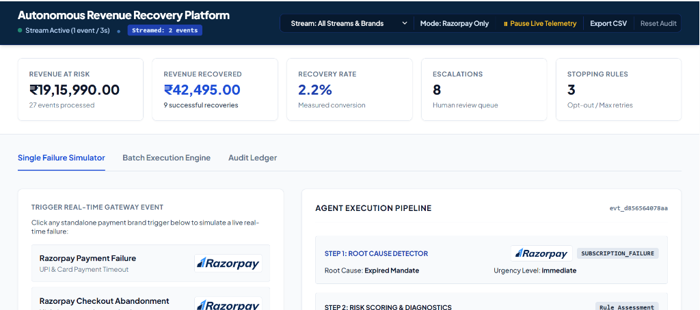
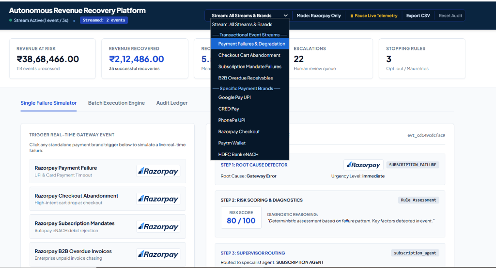
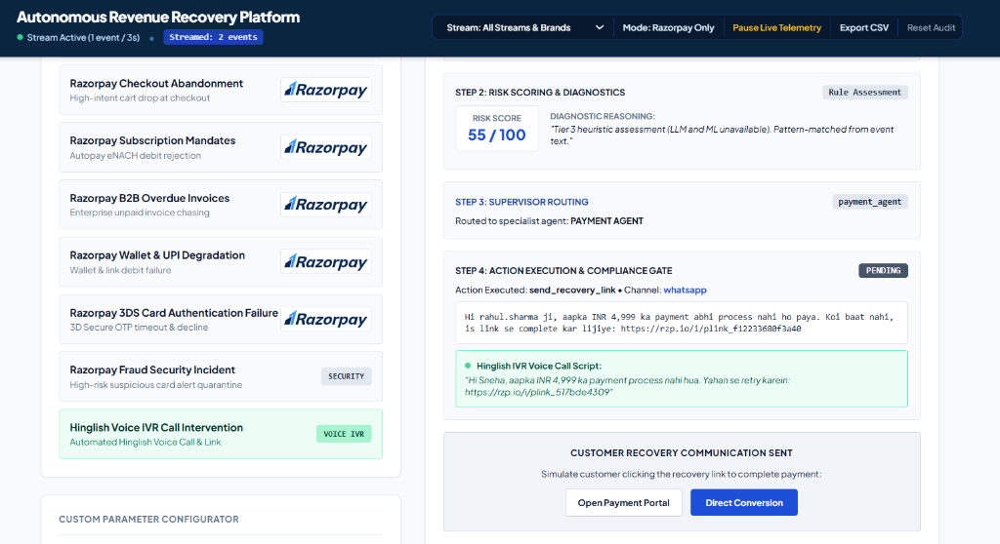
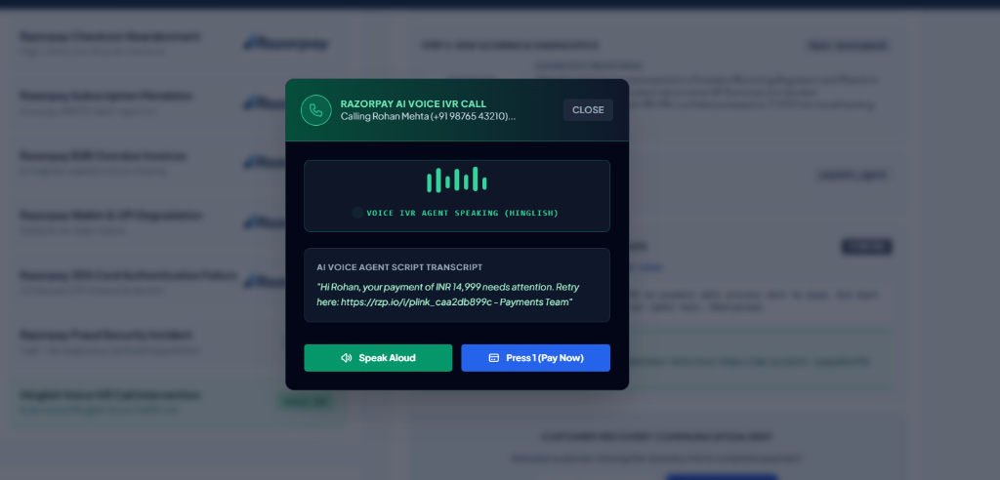
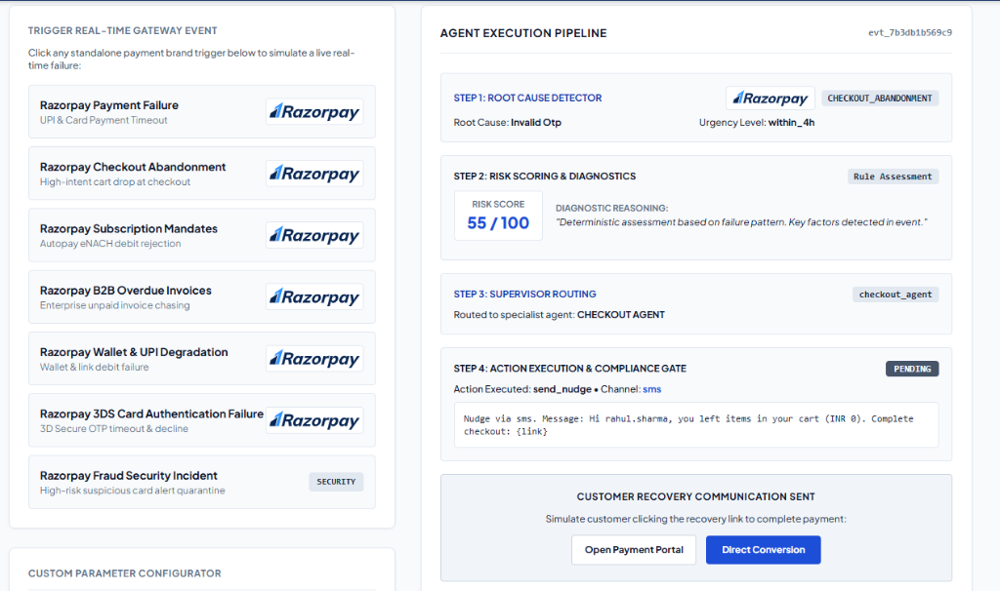
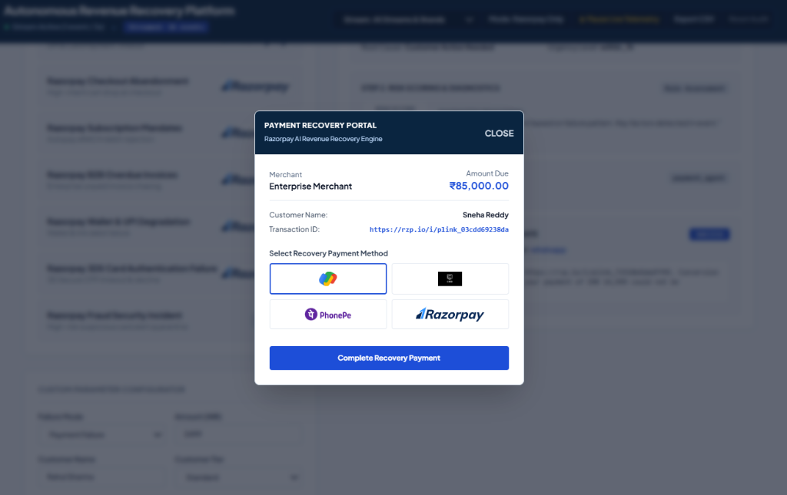
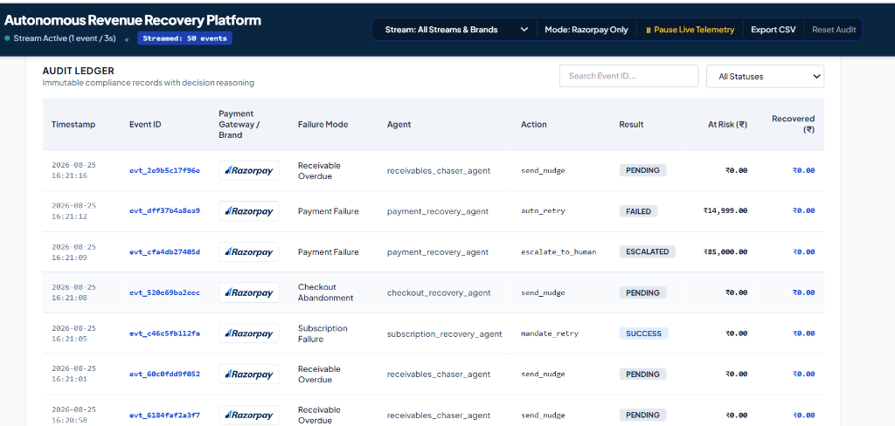
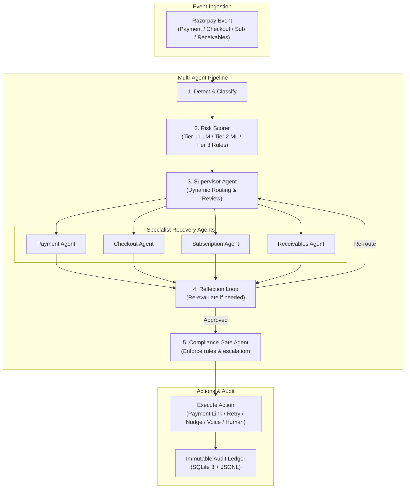
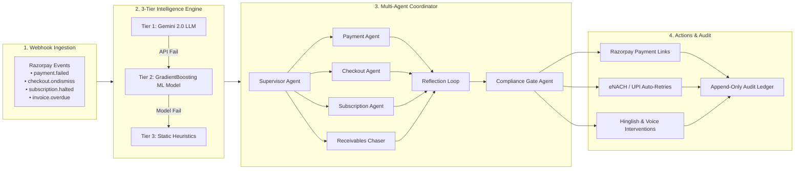

# Razor-RevX: Autonomous AI Revenue Recovery Platform

An enterprise-grade, stateful **hierarchical multi-agent system** natively designed for the Razorpay ecosystem. It detects revenue at risk in real-time across 4 financial failure streams, diagnoses root causes, executes risk-aware recovery actions within compliance guardrails, and maintains an immutable audit trail of money recovered.

---

## Key Architectural Highlights

* **Hierarchical Multi-Agent System:** Stateful Supervisor Agent routes incoming events dynamically to specialist agents (Payment Recovery Agent, Checkout Abandonment Agent, Subscription Mandate Agent, Receivables Chaser Agent), backed by a Reflection Loop for plan validation and an independent Compliance Gate Agent.
* **3-Tier Fallback Resilience Engine:**
  - **Tier 1:** Gemini 2.0 Flash LLM (contextual, qualitative AI risk scoring and hyper-personalized message generation).
  - **Tier 2:** Trained **GradientBoostingRegressor + RandomForestClassifier ML Model** (`scikit-learn`) using 18-dimensional feature vectors for risk scoring (0-100) and action classification when LLM API is unavailable or rate-limited.
  - **Tier 3:** Deterministic Heuristic Engine ensuring 0-downtime emergency fallback under all network conditions.
* **Hinglish & Voice IVR Call Interventions:** Automated Hinglish (Hindi-English mix) recovery messages and simulated IVR Voice Call channels with browser text-to-speech (`SpeechSynthesisUtterance`), strictly policy-scoped to High and Critical risk tier failures (`risk_score >= 65`).
* **Compliance Gate Agent & Stopping Rules:** Autonomous safety guardrails enforcing stopping rules (max 3 attempts per case, customer opt-out verification, DNC enforcement), financial escalation thresholds (amount ≥ ₹50,000 or risk score ≥ 85), and active B2B dispute holds.

---

### Recorded Hinglish Voice IVR Call Audio Samples

The platform includes pre-recorded Hinglish voice call audio samples (`web/assets/audio/`) for high-conversion Indian customer outreach:

* **Payment Failure Voice Call Sample ([hinglish_voice_sample.mp3](web/assets/audio/hinglish_voice_sample.mp3))**:
  > *"Namaste Rahul ji, aapka INR 3,499 ka payment abhi process nahi ho paya. Koi baat nahi — aap is link se payment complete kar sakte hain. Dhanyavaad."*

  <audio controls src="web/assets/audio/hinglish_voice_sample.mp3"></audio>

* **B2B Overdue Invoice Voice Call Sample ([hinglish_voice_receivables_sample.mp3](web/assets/audio/hinglish_voice_receivables_sample.mp3))**:
  > *"Namaste Mutti Solutions, aapka INR 120,000 ka invoice payment overdue hai. Account team se contact karke aaj hi payment clear karein. Dhanyavaad."*

  <audio controls src="web/assets/audio/hinglish_voice_receivables_sample.mp3"></audio>

---

## Product Screenshots & Live Dashboard Walkthrough

### 1. Executive Recovery KPIs & Control Toolbar

*Real-time monitoring of revenue at risk, total recovered INR, recovery rate percentage, escalations, and active telemetry.*

### 2. Live Stream & Payment Brand Filtering Dropdown

*Unified selector toolbar for filtering telemetry events by Transactional Event Streams or Specific Payment Brands (Google Pay, CRED, PhonePe, Paytm, HDFC eNACH).*

### 3. Hinglish Voice IVR Call Execution Pipeline & Live Script

*Step-by-step execution pipeline showing dynamic Hinglish voice call script generation with resolved Razorpay recovery payment link URLs.*

### 4. Interactive Hinglish Voice IVR Call Simulator Modal

*Live interactive IVR Voice Call screen with audio wave animation, Hinglish transcript, text-to-speech audio playback, and Press 1 instant payment trigger.*

### 5. Multi-Agent Execution Pipeline

*Step-by-step diagnostic breakdown showing root cause detection, LLM/ML risk scoring (0-100), supervisor agent routing, and action execution.*

### 6. Razorpay Payment Recovery Portal Modal

*Customer-facing recovery checkout portal supporting instant payment completion across Google Pay, CRED Pay, PhonePe, and Razorpay.*

### 7. Immutable Compliance Audit Ledger

*Complete audit trail logging every decision, agent reasoning, risk score, model used, and payment link generated into an append-only SQLite database.*

---

## System Architecture

### 1. High-Level Multi-Agent Architecture Overview



---

### 2. Deep-Dive Component Flow & 3-Tier Fallback



---

## Tech Stack

| Layer | Technology | Purpose & Implementation |
|---|---|---|
| **AI & Intelligence** | **Gemini 2.0 Flash** (`google-genai`) | Contextual risk scoring (0-100), LTV evaluation & personalized WhatsApp/Email/Voice nudge composition. |
| **ML Fallback Model** | **GradientBoosting & RandomForest** (`scikit-learn`) | Feature-engineered ML regressor & classifier providing 0-downtime intelligent fallback when LLM API is unavailable. |
| **Multi-Agent Engine** | **LangGraph 0.2+ & Pydantic v2** | Hierarchical multi-agent state graph with Supervisor routing, Specialist execution, Reflection loops, and Compliance Gate validation. |
| **Frontend UI** | **HTML5 & Vanilla JavaScript (ES6)** | Zero-framework, high-performance real-time interactive telemetry dashboard. |
| **Styling & Design** | **Tailwind CSS & Google Fonts** | Custom Razorpay Royal Blue design system with **Plus Jakarta Sans** & **Inter** typography. |
| **Audit Ledger** | **SQLite 3 & JSONL** | Append-only immutable compliance database (`recovery_audit.db` & `recovery_audit.jsonl`). |
| **Testing Suite** | **Pytest 8+** | Automated unit, integration, and multi-agent test suite (`pytest tests/`). |

---

## Failure Mode Recovery Matrix

| Failure Mode | Detection Signal | Root Cause Interventions | Recovery Channel |
|---|---|---|---|
| **Razorpay Payment Failure** | `payment.failed` webhook | • `insufficient_funds`: Delayed 24h nudge<br>• `gateway_error`: Instant auto-retry<br>• `invalid_otp`: Instant payment link | WhatsApp / SMS / Hinglish Voice |
| **Checkout Abandonment** | `ondismiss` event | • High intent: Time-decayed discount link<br>• Low intent: Standard reminder | Web / WhatsApp Recovery Link |
| **Subscription Mandate** | `charged_halted` event | • `eNACH rejection`: Mandate retry<br>• `high churn risk`: Plan downgrade offer | Automated Retry / Email / Voice |
| **B2B Overdue Invoices** | Invoice age > SLA | • Aging 1-30d: Soft dunning nudge<br>• Aging 30d+: Promise-to-Pay (PTP) tracker | Professional Email / Phone / Escalation |ional Email / Human Escalation |

---

## Interactive Live Dashboard

Launch the live interactive web demo with real-time telemetry streaming and single-click event simulation:

```bash
# Start the web demonstration server
python web_demo.py --port 8000 --fresh
```

Open `http://localhost:8000` in your browser to view:
- Real-Time Recovery KPI Widgets (Total At-Risk, INR Recovered, Active Events).
- Interactive Event Stream Simulator (Trigger simulated Payment Failures, Cart Drops, eNACH Failures).
- Unified Control Toolbar (Toggle between Razorpay Only & Multi-Brand mode, Start/Pause Live Telemetry).
- Full Trace Inspector & Audit Ledger.

---

## CLI & Batch Run Commands

```bash
# 1. Install dependencies
pip install -r requirements.txt

# 2. Setup Environment Variables
cp .env.example .env
# Edit .env to supply your GEMINI_API_KEY (Optional — deterministic fallback works without it)

# 3. Run full recovery batch simulation
python run_recovery.py --batch-size 100 --mode all --report

# 4. Run mode-specific recovery simulations
python run_recovery.py --batch-size 50 --mode payment --report
python run_recovery.py --batch-size 50 --mode checkout --report
python run_recovery.py --batch-size 50 --mode subscription --report
python run_recovery.py --batch-size 50 --mode receivables --report

# 5. Run test suite
python run_tests.py
# or
pytest tests/ -v
```

---

## Security & Environment Setup

- `.env` files and SQLite audit databases are automatically git-ignored to prevent exposing secrets or sensitive data.
- `.env.example` provides clean template parameters for deployment.

---

## What Broke & How We Solved It

### 1. Upstream LLM Rate Limits & API Quota Exhaustion (HTTP 403)
* **What Broke:** During continuous real-time event streaming (firing simulated webhook events every 3 seconds), the LLM API hit quota rate limits (`403 PERMISSION_DENIED`), threatening to freeze the recovery pipeline and crash the web UI.
* **How We Solved It:** We engineered a **Graceful Deterministic Fallback Engine** (`src/utils/llm.py`). When an LLM API call fails or times out, the system instantly degrades to rule-based heuristic risk scoring (`llm_used = False`) and pre-templated recovery messages. The recovery pipeline runs with **100% zero downtime**.

### 2. Bank eNACH Mandate Failures & Infinite Retry Loops
* **What Broke:** Subscription mandate recoveries entered infinite retry loops when bank servers reported persistent gateway errors, threatening customer harassment and bank penal charges.
* **How We Solved It:** We implemented **Autonomous Stopping Rules & Multi-Rail Fallbacks** (`src/agents/subscription_recovery.py`). We capped retry attempts at 3 (`max_attempts_reached`), enforced customer opt-out verification, and automatically converted failed bank eNACH debits into plan downgrade offers or one-time UPI Payment Links.

### 3. Duplicate Webhook Events & Race Conditions
* **What Broke:** High-velocity network retries sent duplicate webhook events for the same transaction ID, leading to duplicate payment links and cluttered audit entries.
* **How We Solved It:** We built **Idempotency & Attempt Tracking** (`src/audit/audit_trail.py`). The system queries `get_attempts_for_event(event_id)` against an append-only SQLite ledger before taking action, guaranteeing **zero duplicate customer messages and zero double-charging**.

---

## License

Developed for the Razorpay AI Innovation Challenge. Distributed under the MIT License.
